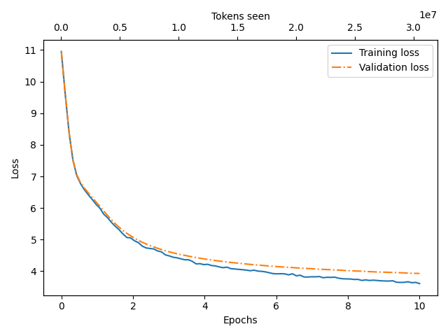
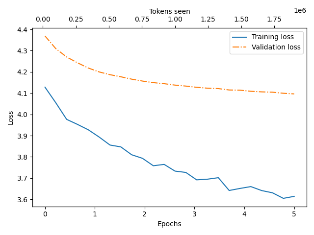
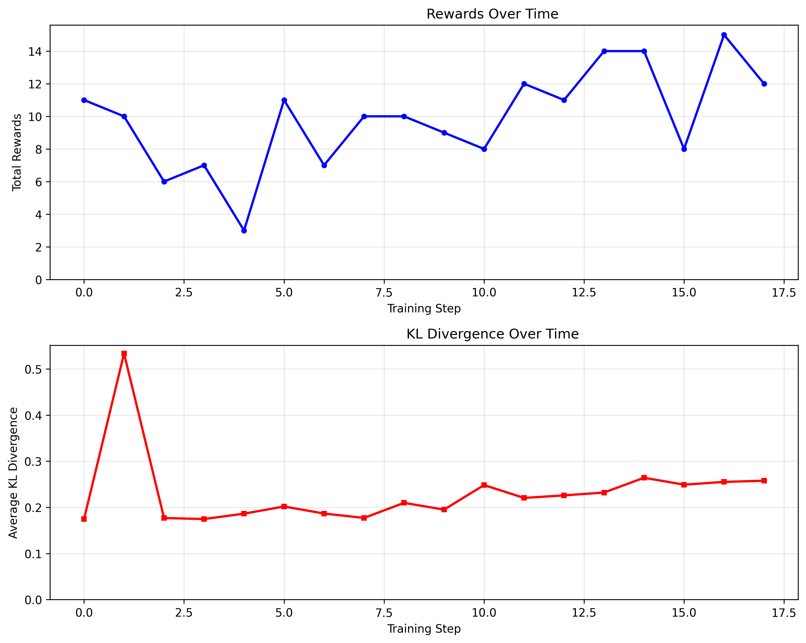

# ⚡️🐐 Faísca - The modern LLM stack in 1000 lines of code

Faísca is a small uv script that implements the "modern" LLM stack in about 1000 lines of code in a single python file.

It includes:

- Complete GPT model implementation
- Pre-training a GPT model from scratch
- Supervised fine-tuning (SFT)
- Reinforcement learning with [GRPO](<https://en.wikipedia.org/wiki/Policy_gradient_method#Group_Relative_Policy_Optimization_(GRPO)>)

I've included a PyTorch version and a MLX version of the code. The MLX version is completely vibed by Codex, so take it with a grain of slop.

Dependencies: `torch`, `tiktoken`, `datasets`, `matplotlib`, and `mlx` (for the MLX version).

## Usage

All you need to get this running is [uv](https://docs.astral.sh/uv/getting-started/installation/).

PyTorch version:

```bash
$ uv run faisca_torch.py
```

MLX version:

```bash
$ uv run faisca_mlx.py
```

You can tweak the config/hyperparameters at the bottom of the script.

_Note: I only tested this on my MacBook Pro (~64GB of RAM)_

## Example dataset/model: Portuguese news headlines 🇵🇹

This code is meant to be changed and adapted. But the example uses a [dataset](https://huggingface.co/datasets/duarteocarmo/ccnews-titles-2016) of headlines in Portuguese (different variants) from CommonCrawl (`ccnews`).

- The GPT model is small: ~13M parameters (4 heads, 4 layers, 128 embedding size)
- **Pre-training**: Pre-train in ~30K headlines, for about 10 epochs.
- **SFT**: Fine-tune in ~20K headlines in Portuguese from Portugal
- **RL**: Uses a reward model that rewards headlines that include anything related to Portuguese football (soccer).

## Training screenshots

### Pre-training



### SFT



### RL with GRPO



## TODO

- [ ] Make MLX version of the script
- [x] Make uv-script for main scripts and delete the rest
- [x] Clean up repo with old scripts, etc
- [x] Details to README (description, inspiration)
- [x] Add images to README
- [ ] Write short article

## Places I copied code/ideas from

- [minGPT from Andrej Karpathy](https://github.com/karpathy/minGPT)
- [LLMs from Scratch - Sebastian Raschka](https://github.com/rasbt/LLMs-from-scratch)
- [RLFromScratch - Ming Yin](https://github.com/mingyin0312/RLFromScratch)
- [minRLHF - Tom Tumiel](https://github.com/ttumiel/minRLHF)
